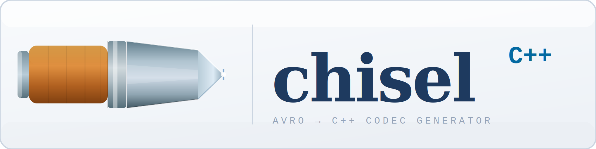

# Chisel

`chisel` is a code generation tool that reads an Avro schema for a record and
creates a header-only C++17 decoding/encoding library for raw Avro datastreams
containing the records.

Written with help of Claude Code.
